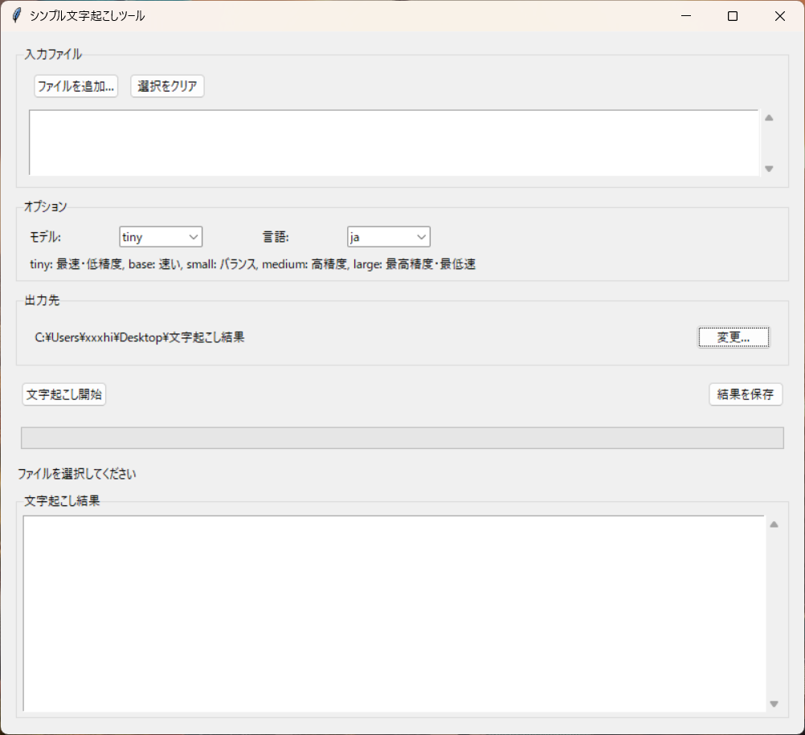

# シンプル文字起こしツール

 

「シンプル文字起こしツール」は、音声や動画ファイルから文字起こしを簡単に行うためのシンプルなGUIアプリケーションです。OpenAIのWhisperを使用して高精度な文字起こしを実現し、特に日本語の文字起こしに最適化されています。

## 特徴

- **シンプルなGUI**: 直感的な操作で簡単に文字起こしができます
- **複数のモデルサイズ**: 精度と速度のバランスに応じて選択可能
- **多言語対応**: 日本語、英語、自動検出に対応
- **FFmpeg内蔵**: 追加のインストールが不要
- **ローカル処理**: モデル初回ダウンロード後はインターネット接続不要
- **進捗表示**: 文字起こし処理の進捗を表示
- **結果保存**: テキストファイルとして結果を保存可能

## 動作環境

- Windows 10以降
- Python 3.7以降 (実行ファイル版は不要)

## インストール方法

### 方法1: 実行ファイルを使用 (推奨)

1. [リリースページ](https://github.com/infoHiroki/SimpleTranscriber/releases/tag/v1.0.0)から最新のリリースをダウンロード
2. `SimpleTranscriber.exe`を実行

### 方法2: Pythonから実行

```bash
# リポジトリをクローン
git clone https://github.com/yourusername/SimpleTranscriber.git
cd SimpleTranscriber

# 必要なパッケージをインストール
pip install -r requirements.txt

# アプリケーションを実行
python main.py
```

## 使い方

1. 「ファイルを追加...」ボタンをクリックして音声または動画ファイルを選択
2. 必要に応じてモデルと言語を選択
   - モデルサイズ: tiny (最速), base (速い), small (バランス), medium (高精度), large (最高精度・最低速)
   - 言語: ja (日本語), en (英語), auto (自動検出)
3. 必要に応じて出力先を変更
4. 「文字起こし開始」ボタンをクリック
5. 文字起こしが完了すると結果が表示される
6. 「結果を保存」ボタンで結果をテキストファイルとして保存（各ファイルは自動的にも保存されます）

## ビルド方法

独自に実行ファイルをビルドする場合は以下の手順に従ってください：

```bash
# 必要なパッケージをインストール
pip install -r requirements.txt

# ビルドスクリプトを実行
python build.py
```

ビルドされた実行ファイルは `dist` ディレクトリに生成されます。

## 注意事項

- 初回実行時にモデルが自動的にダウンロードされます（インターネット接続が必要）
- 大きなファイルの処理にはより多くのメモリと時間が必要です
- 大きなモデル（medium、large）は処理精度が高い反面、メモリ使用量も増加します
- 静かな環境での録音や、高品質の音声ファイルの方が精度が高くなります
- コンピューターの性能によっては処理に時間がかかる場合があります

## ライセンス

MIT

## 謝辞

このプロジェクトは以下のオープンソースプロジェクトに基づいています：

- [OpenAI Whisper](https://github.com/openai/whisper)
